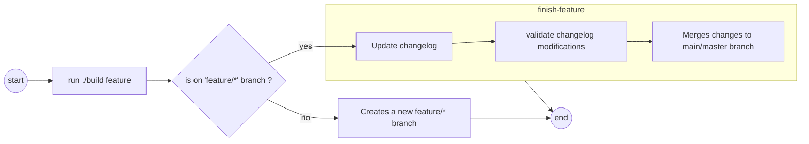

# Candoumbe.Pipelines

[](https://github.com/candoumbe/Pipelines/actions/workflows/delivery.yml?query=branch%3Amain)
[](https://github.com/candoumbe/Pipelines/actions/workflows/integration.yml?query=branch%3Adevelop)
[](https://github.com/candoumbe/pipelines/issues)
[](https://nuget.org/packages/candoumbe.pipelines)

A starter development kit to script your CI/CD using [Nuke].

## Disclaimer

This project adheres to [semantic versioning].

Major version zero (0.y.z) is for initial development. **Anything MAY change at any time**.

The public API SHOULD NOT be considered stable.

## The problem

Most of the time, to set up a CI/CD for your .NET project, you have two options :

### **Going through your repository and use its embeded GUI to create the pipeline**

This approach is nice and helpful to get started. But most of the time, the history of changes made to the pipeline
is separated from the history of the code base.

### **Writing a pipeline file of some sort**

Most of the time in YAML, the file that describes the steps required to build a project are providers specific.
So even though you can write YAML, knowning how to write an Azure DevOps pipeline does not really help when it comes to writing a pipeline for GitHub Actions.

## The solution

This project offers an opinionated way at writing pipelines by giving a set of components (more on that later) with the following benefits :

1. no need to go your code management tool to set up your project CI/CD.
2. no more YAML file : yeah YAML is great but the tooling around it is not great and the structure itself is error prone.
3. it's just a C# that every team member can contribute to !
4. it sits right with your source code so that each change to the pipeline is just a commit into your
codebase.

### Try it out

To get started you'll have to :

1. install [Nuke.GlobalTool] dotnet tool (locally or globally)
2. run `dotnet nuke :setup` to setup your pipeline project
3. replace the `Nuke.Common` nuget dependency with [Candoumbe.Pipelines]

From this point, you should be able to customize your pipeline by adding [components] \o/.

### How does it works ?

This library is built on top of [Nuke], an open source library started by [Mathias Klock].
It provides a set of components that, when added to a pipeline, bring clever default features.

Components are C# interfaces that come with a default / opinionated implementation.
They are grouped in namespaces which correspond to their main task.

- `Candoumbe.Pipelines.Components` : contains the core components needed for general required tasks.

Let's say you have the following `Build.cs` class as your starting pipeline

```csharp
class Build : NukeBuild
{
    public static void Main() => Execute<Build>(x => x.Compile());

    Target Compile => _ => _
        .Executes(() => {

            // Code omitted for brievity

        });
}
```

you can get rid of the `Compile` property and use the [ICompile] component instead.

```csharp
class Build : NukeBuild, ICompile
{
    public static void Main() => Execute<Build>(x => ((ICompile)x).Compile());

}
```

In the example above, the build pipeline benefits from the [ICompile] component which comes with a default implementation of the `Compile` target.

#### `Candoumbe.Pipelines.Components.Workflows`

Contains components related to branching strategies and providing tools that can help normalize how teams
works in.

[IGitFlow] and [IGitHubFlow] are two components that helps handle branching strategy locally.

- GitFlow


- GitHubFlow



Some components are used to set the workflow to use throughout a repository and streamline the work of a developer and a team.

 Both [`IGitFlowWithPullRequest`] and [`IGithubFlowWithPullRequest`] were created with that goal in mind.

#### `Candoumbe.Pipelines.Components.NuGet`

Contains classes required to push nuget packages to repositories.

#### `Candoumbe.Pipelines.Components.GitHub`

Contains classes and components needed to interact with GitHub repositories (creating pull requests).

#### `Candoumbe.Pipelines.Components.Docker`

Contains classes and components needed to build and push docker images.

⚠️ **Some components may require additional packages and/or tools to be installed in order to be fully functional.**
**For example, the default implementation of `IMutationTest` uses [`Stryker`](https://nuget.org/packages/stryker) to run mutation tests**.

You can refer to [Nuke's documentation](https://www.nuke.build/docs/common/cli-tools/) to see how to reference required tools.

### Want to contribute ?

You can contribute by opening an [issue](https://github.com/candoumbe/Pipelines/issues/new/choose) or submitting a feature request.

PRs are welcome  (check out the [contribution guidelines] if you want to contribute to this project) !

## Special thanks

- [Nuke] as the engine behind the scene

[Nuke]: https//github.com/nuke/
[Nuke.GlobalTool]: https://nuget.org/packages/Nuke.GlobalTool
[Mathias Klock]: dummy@email.com
[Candoumbe.Pipelines]: https://nuget.org/packages/Candoumbe.Pipelines
[contribution guidelines]: CONTRIBUTING.md
[semantic versioning]: https://semver.org/spec/v2.0.0.html
[ICompile]: ./src/Candoumbe.Pipelines/Components/ICompile.cs
[IGitFlow]: ./src/Candoumbe.Pipelines/Components/Workflows/IGitFlow.cs
[IGitHubFlow]: ./src/Candoumbe.Pipelines/Components/Workflows/IGitHubFlow.cs
